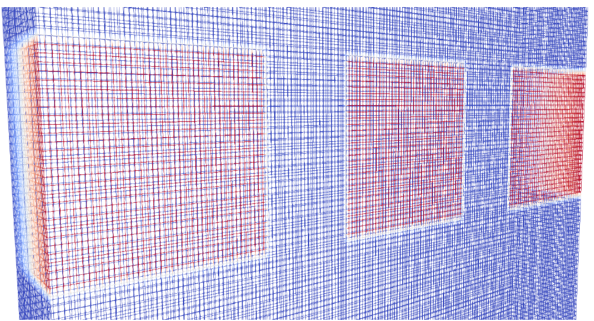
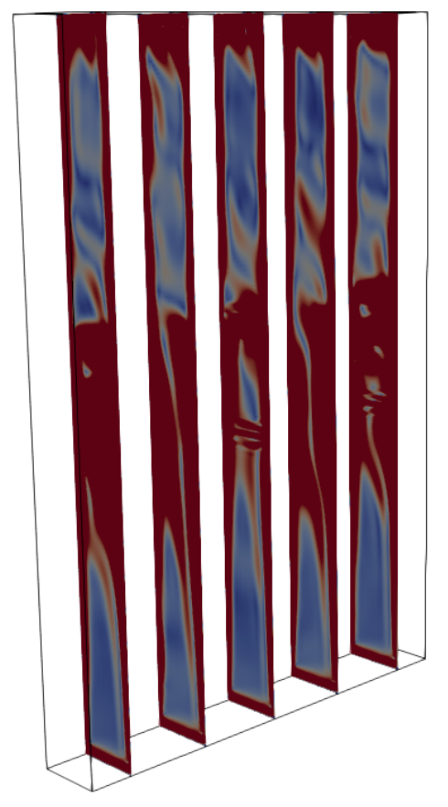
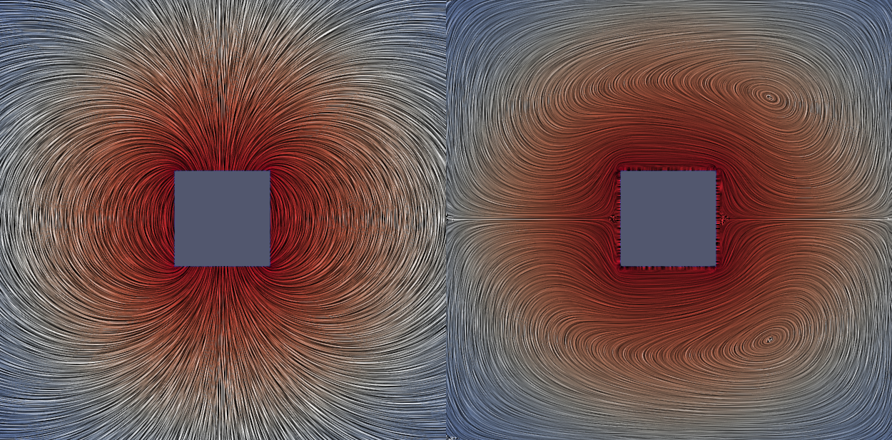
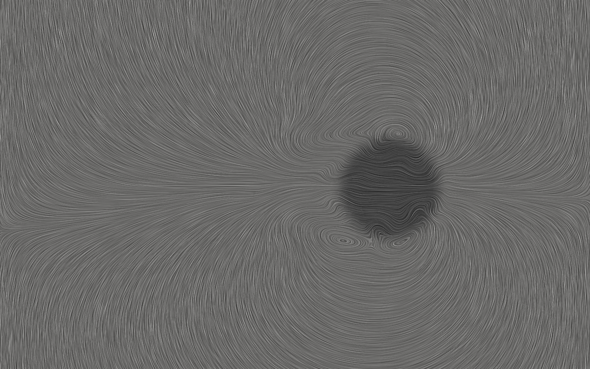
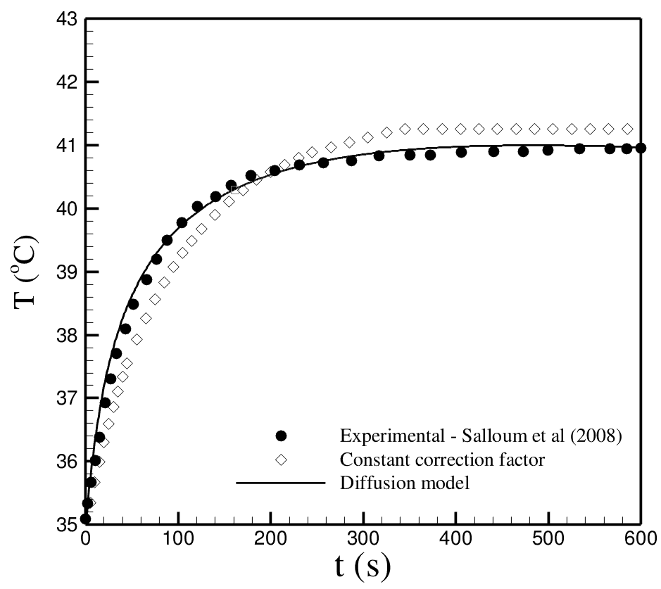

# fhdFoam — Ferrohydrodynamics + OpenFOAM


---

## 📌 Table of Contents
- [fhdFoam — Ferrohydrodynamics + OpenFOAM](#fhdfoam--ferrohydrodynamics--openfoam)
  - [📌 Table of Contents](#-table-of-contents)
  - [🚀 What is fhdFoam?](#-what-is-fhdfoam)
    - [🎯 Philosophy](#-philosophy)
  - [🧠 Solvers](#-solvers)
  - [⚙️ Pre-requisites](#️-pre-requisites)
  - [🛠️ Installation](#️-installation)
  - [🖥️ Graphical User Interface](#️-graphical-user-interface)
  - [▶️ Running Simulations Manually](#️-running-simulations-manually)
  - [🖼️ Gallery](#️-gallery)
  - [📚 References](#-references)
  - [⭐ Final Notes](#-final-notes)

---

## 🚀 What is fhdFoam?

**fhdFoam** is an open-source collection of customized OpenFOAM solvers for **ferrohydrodynamic (FHD)** problems.

Besides a set of solvers and tutorial cases, this repository includes pre-programmed python and bash scripts designed to provide a graphical user interface to handle pre and post-proccess funcionalities. These scripts interact with the user through a graphical user interface (GUI) asking questions that are used to configure the simulations by altering dictionaries of the tutorial cases.

💡 In simple terms:
> A modular environment to simulate magnetic fluid flows under different physical assumptions.

### 🎯 Philosophy

> *“One solver for each physics.”*

Since the general set of governing equations of FHD can be quite complicated and subjected to different versions depending on the assumptions used to build the physical models, we believe that providing different solvers for different physics is not only practical but also pedagogical. The idea of different set of equations for different problems may serve as a mean to teach ferrohydrodynamics for fluid dynamicists which are not used to the inclusion of magnetic effects on the Newtonian version of the Navier-Stokes equations.

---

## 🧠 Solvers

- 🔥 **magnetoconvectionFoam** → Thermomagnetic convection  
- 🫧 **intermagFoam** → Two-phase magnetic flow  
- 🧬 **mhtFoam** → Magnetic hyperthermia  
- ⚙️ **icomagFoam** → Non-equilibrium magnetization  

---

## ⚙️ Pre-requisites

- OpenFOAM v2306+
- ParaView
- Python 3+

```bash
sudo apt-get install python3-matplotlib
pip3 install customtkinter
```

---

## 🛠️ Installation

```bash
git clone https://github.com/lcec-unb/fhdfoam.git
cd fhdfoam
./install.sh
```

---

## 🖥️ Graphical User Interface

**fhdFoam** also comes with a graphical user interface (GUI). This GUI is developed based on the idea that people with no previous openFoam experience could play with **fhdFoam** using a simple graphical user interface (GUI) that will configure the scenario the user wants to simulate. So more people can simulate interesting problems in the context of **FHD**.

After installing all the python packages and pre-requisites to use **fhdFoam** you may call *fhdFoam's GUI* by typing inside the main folder: 

```bash
./fhdFoam.sh
```

---

## ▶️ Running Simulations Manually

In order to run the simulations manually, once you have compiled the solvers of the project you just need to copy the tutorial cases to your user folder and edit manually the configuration files. All cases come with *Allrun*, *Allclean* and *Allpre* scripts in order to help the user with the necessary procedures to run each simulation scenario.


```bash
./Allrun.sh
./Allclean.sh
./Allpre.sh
```

---

## 🖼️ Gallery

Bellow we show the mesh used for the 3D cavity problem associated with thermomagnetic convection using a three magnet array to induce the magnetic field simulated with magnetoconvectionFoam



Here we may see a partial obstruction of the flow in the region of action of the magnetic field. These results are published in Ref [3].

<div class="figure-center">  </div> 

In order to validate the magnetoconvectionFoam we have considered the benchmark proposed by Refs [4] and [7]. Bellow you may see the magnetic field lines and the streamtraces for a thermomagnetic induced flow, based on the benchmark of Ashouri and Shafii [7].

<div class="figure-center">  </div> 

Bellow we can see the vortex induced by the motion of a magnetic drop being carried by the action of an external magnetic field in a simulation performed with intermagFoam.

<div class="figure-center">  </div> 

Bellow we show the temperature evolution at the center of a 5mm spherical tumour subjected to magnetic hyperthermia using our mhtFoam solver. Comparisons are made with the experimental data of Ref[6].

<div class="figure-center">  </div> 

---

## 📚 References

[1] Gontijo, Rafael Gabler, and Andrey Barbosa Guimarães. "Langevin dynamic simulations of magnetic hyperthermia in rotating fields." Journal of Magnetism and Magnetic Materials 565 (2023): 170171. [DOI: 10.1016/j.jmmm.2022.170171](https://doi.org/10.1016/j.jmmm.2022.170171).

[2] Tang, Yundong, et al. "Effect of nanofluid distribution on therapeutic effect considering transient bio-tissue temperature during magnetic hyperthermia." Journal of Magnetism and Magnetic Materials 517 (2021): 167391. [DOI: 10.1016/j.jmmm.2020.167391](https://doi.org/10.1016/j.jmmm.2020.167391).

[3] Alegretti, C. F., and R. G. Gontijo. "An experimental investigation of thermomagnetic convection in a tall enclosure subjected to progressive field gradients." International Communications in Heat and Mass Transfer 158 (2024): 107846. [DOI: 10.1016/j.icheatmasstransfer.2024.107846](https://doi.org/10.1016/j.icheatmasstransfer.2024.107846).

[4] Cunha, Lucas HP, et al. "A numerical study on heat transfer of a ferrofluid flow in a square cavity under simultaneous gravitational and magnetic convection." Theoretical and Computational Fluid Dynamics 34.1 (2020): 119-132. [DOI: 10.1007/s00162-020-00515-1](https://doi.org/10.1007/s00162-020-00515-1).

[5] de Carvalho, Douglas Daniel, and Rafael Gabler Gontijo. "Magnetization diffusion in duct flow: The magnetic entrance length and the interplay between hydrodynamic and magnetic timescales." Physics of Fluids 32.7 (2020). [DOI: 10.1063/5.0011916](https://doi.org/10.1063/5.0011916). 

[6] Salloum, Maher, Ronghui Ma, and Liang Zhu. "An in-vivo experimental study of temperature elevations in animal tissue during magnetic nanoparticle hyperthermia." International Journal of Hyperthermia 24.7 (2008): 589-601. [DOI: 10.1080/02656730802203377](https://doi.org/10.1080/02656730802203377).

[7] Ashouri, Majud and Shafii, Mohammad Behshad. "Numerical simulation of magnetic convection ferrofluid flow in a permanent magnet-inserted cavity." Journal of Magnetism and Magnetic Materials, 442 (2017): 270-278. [DOI: 10.1016/j.jmmm.2017.06.089](https://doi.org/10.1016/j.jmmm.2017.06.089).

---

## ⭐ Final Notes

fhdFoam is both a research tool and a learning platform.

