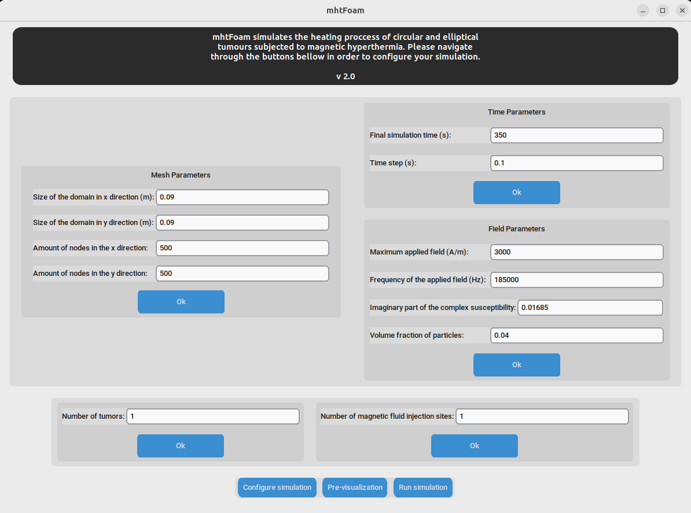
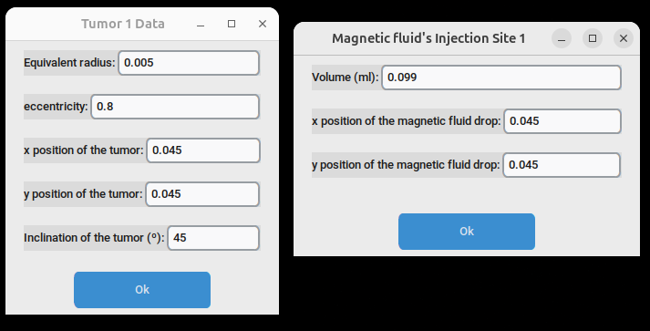
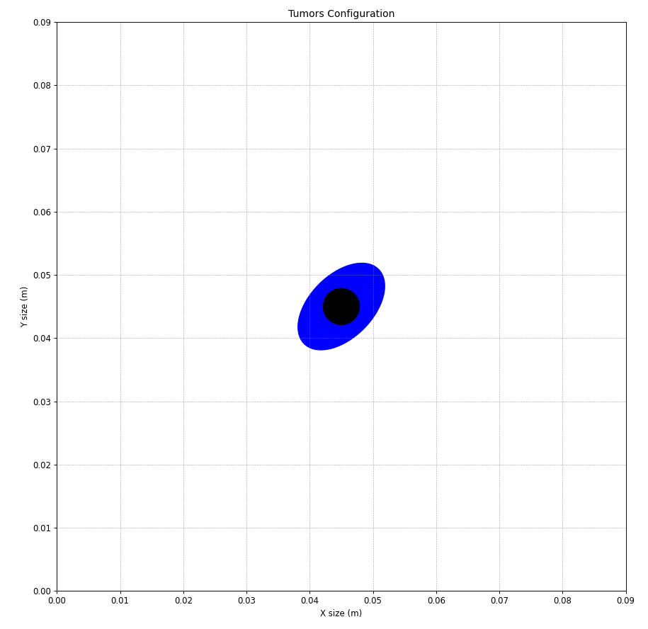
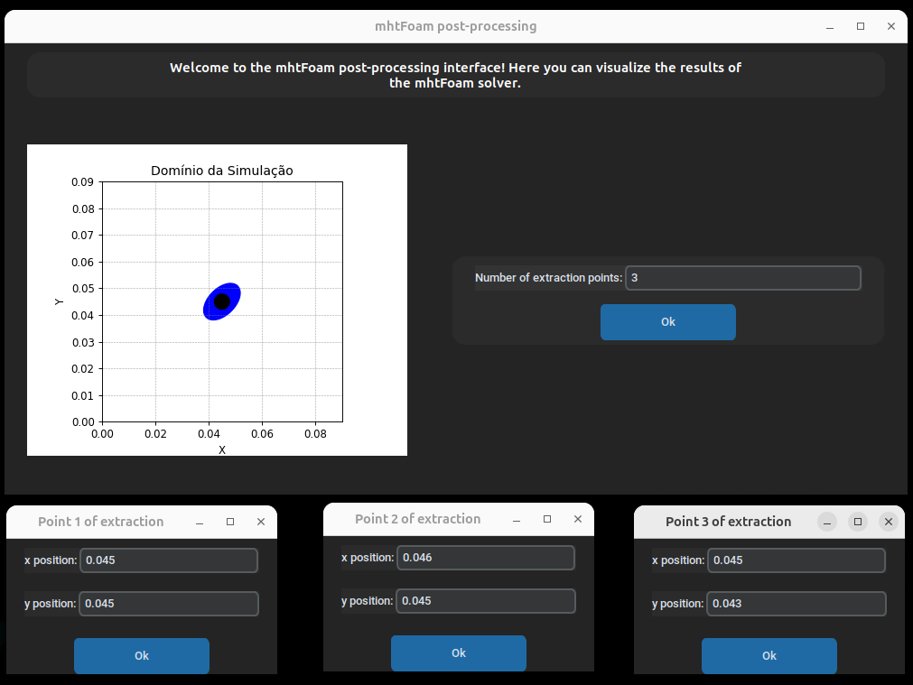
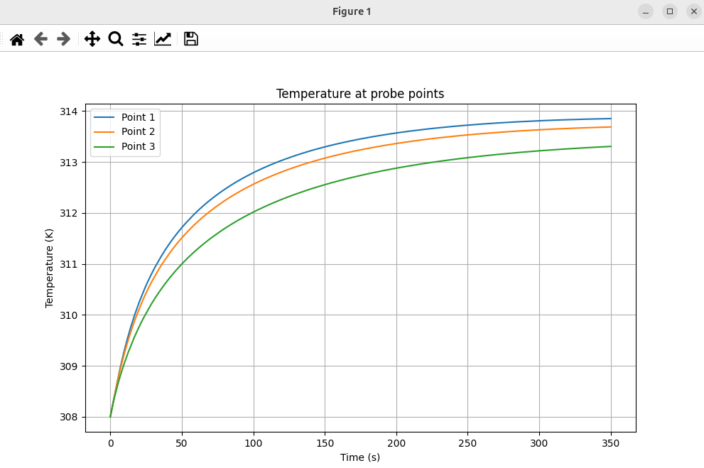
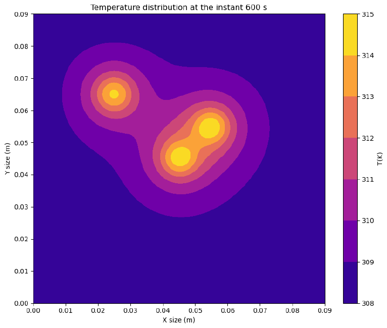

# 🧲 mhtStudio  
### Graphical Pre- and Post‑Processing Interface for **mhtFoam** (OpenFOAM)

mhtStudio is a lightweight, OpenFOAM‑native graphical interface designed to **configure**, **run**, and **post‑process** simulations performed with the `mhtFoam` solver, with a focus on **magnetic hyperthermia** applications.

It does **not replace OpenFOAM logic**. Instead, it acts as a structured, reproducible front‑end that alters specfic dictionaries, executes standard OpenFOAM utilities, and visualizes results.

The GUI is built using Python with tkinter. It was designed to intermediate the interaction between a non-experienced OpenFOAM user and the necessary configuration files and terminal executions to run magnetic-hyperthermia simulations using the mhtFoam. It acts on the files that are located in the ``fhdFoam/tutorials/mhtFoam/GUI_2d_circular_tumor/`` folder.

> ⚠️ **IMPORTANT — READ FIRST**  
> **mhtStudio ONLY works inside a sourced OpenFOAM environment.**  
> If OpenFOAM is not sourced, the application will fail silently or behave incorrectly.

---

## ✨ Main Features

- GUI‑based **pre‑processing** of mhtFoam cases
- Interactive **definition of probe locations**
- Automated execution of:
  - `postProcess` (for probes `T` and `W`)
  - Custom plotting routines
- Real‑time **progress feedback** during probe extraction
- Clean separation between:
  - OpenFOAM execution
  - Python visualization
- Fully compatible with **headless / remote execution**

---

## 📁 Repository Structure

```
fhdFoam/
├── apps/
│   └── mhtStudio/
│       ├── Allclean.sh
│       ├── install.sh
│       ├── edit_lybraries.py
│       ├── main_pre.py
│       ├── main_pos.py
│       ├── plots.py
│       ├── run_pre.sh
│       ├── run_pos.sh
│       └── README.md
│
├── figs/
│   ├── mhtStudio_pre_gui.png
│   ├── mhtStudio_pos_gui.png
│   └── probe_results_example.png
```

All commands must be executed from:

```
fhdFoam/apps/mhtStudio
```

---

## 🧪 OpenFOAM Environment (MANDATORY)

Before doing **anything** you must source your current OpenFOAM instalation by activating an internal openfoam shell session. **mhtStudio only work in an active OpenFOAM shell**.

---

## ⚙️ Installation

Create and configure the local Python virtual environment:

```bash
cd fhdFoam/apps/mhtStudio
./install.sh
```

This will:

- Create `.venv/`
- Install Python dependencies
- Keep isolation from system Python and Conda

> ❌ **Do NOT use Conda Python for GUI execution**  
> It causes Tk/Tcl rendering issues.

---

## 🚀 Pre‑Processing Workflow

Launch the **pre‑processing GUI**:

```bash
./run_pre.sh
```

This interface allows you to:

- Define domain geometry
- Configure tumors and magnetic fluids
- Generate required dictionaries for `mhtFoam`

📌 Output files are written directly into the OpenFOAM case.

<p align="center">
  
</p>

<p align="center">
  
</p>

<p align="center">
  
</p>
---

## 📊 Post‑Processing Workflow

Launch the **post‑processing GUI**:

```bash
./run_pos.sh
```

The post‑processing interface allows you to:

1. Define probe locations interactively
2. Automatically update `controlDict`
3. Run:
   ```bash
   postProcess -fields '(T W)'
   ```
4. Visualize:
   - Temperature vs time
   - Perfusion vs time
   - Final 2D temperature field

A real‑time progress window shows the **current simulation time being extracted**.

<p align="center">
  
</p>

<p align="center">
  
</p>

<p align="center">
  
</p>

---

## 📌 Probes Requirements

Your `controlDict` **must contain** a valid probes function:

```foam
functions
{
    probes
    {
        type            probes;
        libs            ("libsampling.so");
        writeControl    timeStep;
        writeInterval   1;

        fields
        (
            T
            W
        );

        probeLocations
        (
            (0.0 0.0 0)
        );
    }
}
```

mhtStudio **only edits `probeLocations`** — it never changes field names or write controls.

---

## 🧼 Cleaning

To remove generated artifacts:

```bash
./Allclean.sh
```

This safely removes:

- `postProcessing/`
- Temporary Python outputs

---

## 🛠️ Design Philosophy

- **OpenFOAM first** — no hidden magic
- Python used strictly for:
  - GUI
  - Orchestration
  - Visualization
- If the case works manually, **it will work in mhtStudio**
- Easy to debug using standard OpenFOAM tools

---

## 🧠 Troubleshooting

| Problem | Cause |
|------|------|
| GUI opens but nothing runs | OpenFOAM not sourced |
| Probes stop early | `postProcess` interrupted |
| Tk errors on exit | Safe and expected (handled internally) |
| Blank plots | Probe files not generated |

Logs are written to:

```
run_pre.log
run_pos.log
```

---

## 📜 License & Use

Academic and research use.  
Part of the **fhdFoam / mhtFoam ecosystem**.

---

## 👨‍🏫 Authors

**Prof. Rafael Gabler Gontijo**  
**Eng. André de Oliveira Brandão**  
Laboratory of Scientific Computing in Complex Flows (LCEC‑UnB)

---
